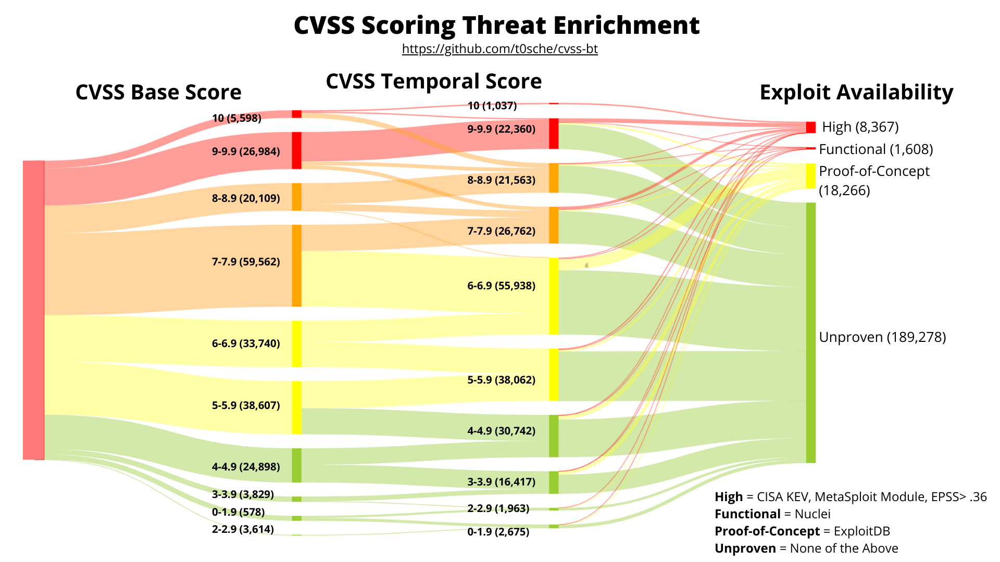

# cvss-bt
Enriching the NVD CVSS scores to include Temporal/Threat Metrics

## Overview

The Common Vulnerability Scoring System (CVSS) is an industry standard for assessing the severity of computer system security vulnerabilities. CVSS attempts to establish a measure of how severe a vulnerability is based on its attributes.

The National Vulnerability Database includes CVSS Base scores in its catalog, but base scores are not enough to effectively prioritizie or contextualize vulnerabilities. In this repository I continuously enrich the CVSS score by using the Exploit Code Maturity/Exploitability (E) Temporal Metric.

### Temporal Metric - Exploit Code Maturity/Exploitability (E)

Sources:
- https://www.first.org/cvss/v4-0/cvss-v40-specification.pdf
- https://www.first.org/cvss/v3.1/specification-document
- https://www.first.org/cvss/v3.0/specification-document
- https://www.first.org/cvss/v2/guide

| Value | Description | CVE Present In |
|---------------------------|-------------|-------------|
| Attacked (A) (v4.0) | Based on available threat intelligence either of the following must apply: Attacks targeting this vulnerability (attempted or successful) have been reported. Solutions to simplify attempts to exploit the vulnerability are publicly or privately available (such as exploit toolkits) | [CISA KEV](https://www.cisa.gov/known-exploited-vulnerabilities-catalog), [VulnCheck KEV](https://vulncheck.com/kev), [EPSS](https://www.first.org/epss/) > Threshold, [Metasploit](https://www.metasploit.com/) |
| High (H) (v3.1/3.0/2.0)| Functional autonomous code exists, or no exploit is required (manual trigger) and details are widely available. Exploit code works in every situation, or is actively being delivered via an autonomous agent (such as a worm or virus). Network-connected systems are likely to encounter scanning or exploitation attempts. Exploit development has reached the level of reliable, widely available, easy-to-use automated tools. | [CISA KEV](https://www.cisa.gov/known-exploited-vulnerabilities-catalog), [VulnCheck KEV](https://vulncheck.com/kev), [EPSS](https://www.first.org/epss/) > Threshold, [Metasploit](https://www.metasploit.com/) |
| Functional (F) (v3.1/3.0/2.0) | Functional exploit code is available. The code works in most situations where the vulnerability exists. | [Nuclei](https://github.com/projectdiscovery/nuclei) |
| Proof-of-Concept (P) (v4.0/3.1/3.0/2.0) | Proof-of-concept exploit code is available. The code might not work in all situations. | [ExploitDB](https://www.exploit-db.com/), [PoC-in-GitHub](https://github.com/nomi-sec/PoC-in-GitHub) |
| Unproven (U) (v4.0/3.1/3.0/2.0) | No exploit code is available, or an exploit is theoretical. | CVE not present in any threat intelligence source above. |
| Not Defined (X) (v4.0/3.1/3.0/2.0) | Assigning this value to the metric will not influence the score. It means the user does not have enough information to assign a score. | We drop this value since we have information to assign a score. |

## Features
This repository continuously enriches and publishes CVSS Temporal Scores based on the following threat intelligence:

- CISA KEV
- VulnCheck KEV
- EPSS
- Metasploit
- Nuclei
- ExploitDB
- PoC-in-GitHub

### Steps
- Fetches EPSS scores every morning
- Fetches CVSS scores from NVD if there are new EPSS scores.
- Calculates the Exploit Code Maturity/Exploitability (E) Metric when new data is found.
- Provides a resulting CVSS-BT score for each CVE

## Caveats
- In the event that the NVD calculated score is using a lesser version than a secondary source, I use the higher CVSS version.
- The EPSS threshold for returning an `E:H` or `E:A` value is .36, or 36%. This is based on the F1 score of the model and the 37% threshold where most CVEs have weaponized exploit code.
- I do not recommend using this percentage as a general threshold to prioritize on.

## CVSS Visual Mapping
This data visualization provides a breakdown of how the CVSS-B, CVSS-BT and CVSS enriched temporal metrics map to the defined OSINT sources as of November 25th, 2023

## Acknowledgements

This product uses VulnCheck KEV.

This product uses EPSS scores but is not endoresed or certified by the EPSS SIG.
