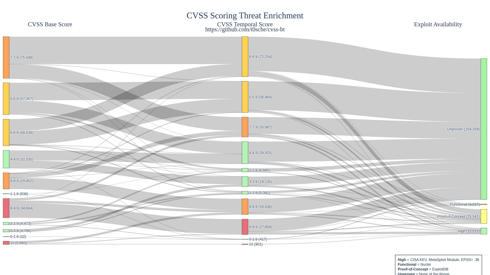

# cvss-bt
Enriching the NVD CVSS scores to include Temporal/Threat Metrics

## Overview

The Common Vulnerability Scoring System (CVSS) is an industry standard for assessing the severity of computer system security vulnerabilities. CVSS attempts to establish a measure of how severe a vulnerability is based on its attributes.

The National Vulnerability Database includes CVSS Base scores in its catalog, but base scores are not enough to effectively prioritizie or contextualize vulnerabilities. In this repository I continuously enrich the CVSS score by using the Exploit Code Maturity/Exploitability (E) Temporal Metric.

### Temporal Metric - Exploit Code Maturity/Exploitability (E)

Sources:
- https://www.first.org/cvss/v4-0/cvss-v40-specification.pdf
- https://www.first.org/cvss/v3.1/specification-document
- https://www.first.org/cvss/v3.0/specification-document
- https://www.first.org/cvss/v2/guide

| Value | Description | CVE Present In |
|---------------------------|-------------|-------------|
| Attacked (A) (v4.0) | Based on available threat intelligence either of the following must apply: Attacks targeting this vulnerability (attempted or successful) have been reported. Solutions to simplify attempts to exploit the vulnerability are publicly or privately available (such as exploit toolkits) | [CISA KEV](https://www.cisa.gov/known-exploited-vulnerabilities-catalog), [VulnCheck KEV](https://vulncheck.com/kev), [EPSS](https://www.first.org/epss/) > Threshold, [Metasploit](https://www.metasploit.com/) |
| High (H) (v3.1/3.0/2.0)| Functional autonomous code exists, or no exploit is required (manual trigger) and details are widely available. Exploit code works in every situation, or is actively being delivered via an autonomous agent (such as a worm or virus). Network-connected systems are likely to encounter scanning or exploitation attempts. Exploit development has reached the level of reliable, widely available, easy-to-use automated tools. | [CISA KEV](https://www.cisa.gov/known-exploited-vulnerabilities-catalog), [VulnCheck KEV](https://vulncheck.com/kev), [EPSS](https://www.first.org/epss/) > Threshold, [Metasploit](https://www.metasploit.com/) |
| Functional (F) (v3.1/3.0/2.0) | Functional exploit code is available. The code works in most situations where the vulnerability exists. | [Nuclei](https://github.com/projectdiscovery/nuclei) |
| Proof-of-Concept (P) (v4.0/3.1/3.0/2.0) | Proof-of-concept exploit code is available. The code might not work in all situations. | [ExploitDB](https://www.exploit-db.com/), [PoC-in-GitHub](https://github.com/nomi-sec/PoC-in-GitHub) |
| Unproven (U) (v4.0/3.1/3.0/2.0) | No exploit code is available, or an exploit is theoretical. | CVE not present in any threat intelligence source above. |
| Not Defined (X) (v4.0/3.1/3.0/2.0) | Assigning this value to the metric will not influence the score. It means the user does not have enough information to assign a score. | We drop this value since we have information to assign a score. |


## Features
This repository continuously enriches and publishes CVSS Temporal Scores based on the following threat intelligence:

- CISA KEV
- VulnCheck KEV
- EPSS
- Metasploit
- Nuclei
- ExploitDB
- PoC-in-GitHub

### Steps
- Fetches EPSS scores every morning
- Fetches CVSS scores from NVD if there are new EPSS scores.
- Calculates the Exploit Code Maturity/Exploitability (E) Metric when new data is found.
- Provides a resulting CVSS-BT score for each CVE

## Custom Configuration

This project now supports customizable risk thresholds and scoring to allow organizations to tailor vulnerability prioritization to their specific needs and risk tolerance.

### Configuration Options

Create a `config.yaml` file in the project root directory with the following options:

```yaml
# Thresholds for exploit maturity classification
thresholds:
  # EPSS score threshold (0.0 to 1.0) for high exploitability classification
  epss: 0.36
  
# Weights for intelligence sources (0.0 to 1.0)
# Higher weights give the source more influence on exploit maturity classification
weights:
  cisa_kev: 1.0
  vulncheck_kev: 1.0
  epss: 0.9
  metasploit: 0.8
  nuclei: 0.6
  exploitdb: 0.4
  poc_github: 0.3
  
# Scoring thresholds for exploit maturity classifications
# These determine the weighted score needed to qualify for each maturity level
scoring:
  # Minimum weighted score to qualify as Attacked/High (E:A/E:H)
  high_threshold: 0.8
  # Minimum weighted score to qualify as Functional (E:F)
  functional_threshold: 0.6
  # Minimum weighted score to qualify as Proof-of-Concept (E:P)
  poc_threshold: 0.3
  
# Enable/disable specific intelligence sources
enabled_sources:
  cisa_kev: true
  vulncheck_kev: true
  epss: true
  metasploit: true
  nuclei: true
  exploitdb: true
  poc_github: true
```

### How Customization Works

The system uses a weighted scoring approach to determine the exploit maturity level:

1. **Weighted Scoring**: Each intelligence source is assigned a weight between 0 and 1. When a vulnerability appears in a source, it accumulates the corresponding weight.

2. **Normalized Score**: The total accumulated weight is normalized against the maximum possible score to produce a value between 0 and 1.

3. **Maturity Classification**: The normalized score is compared against the thresholds defined in the `scoring` section to determine the appropriate exploit maturity level (E:A/E:H, E:F, or E:P).

4. **CVSS Version Handling**: The system automatically assigns the correct temporal metric designation based on the CVSS version (E:A for CVSS v4.0, E:H for earlier versions, etc.).

### Example Configurations

#### High Security Posture
```yaml
thresholds:
  epss: 0.20  # Lower threshold to be more conservative
scoring:
  high_threshold: 0.5  # Treat more vulnerabilities as high exploit maturity
  functional_threshold: 0.3
  poc_threshold: 0.1
```

#### Focused on Known Exploits
```yaml
weights:
  cisa_kev: 1.0
  vulncheck_kev: 1.0
  metasploit: 1.0
  epss: 0.5  # Less emphasis on prediction
  nuclei: 0.4
  exploitdb: 0.2
  poc_github: 0.1
```

#### Disable Specific Sources
```yaml
enabled_sources:
  cisa_kev: true
  vulncheck_kev: true
  epss: true
  metasploit: true
  nuclei: false  # Disable Nuclei
  exploitdb: false  # Disable ExploitDB
  poc_github: false  # Disable PoC-in-GitHub
```

### Output

When using custom configuration, the system generates an additional file called `cvss-bt-config.json` that documents the configuration used for the analysis. The output CSV also includes a `weighted_score` column that shows the calculated score for each vulnerability, providing transparency in how the classifications were determined.

## CVSS Visual Mapping
This data visualization provides a breakdown of how the CVSS-B, CVSS-BT and CVSS enriched temporal metrics map to the defined OSINT sources as of November 25th, 2023


## Acknowledgements

This product uses VulnCheck KEV.

This product uses EPSS scores but is not endoresed or certified by the EPSS SIG.
