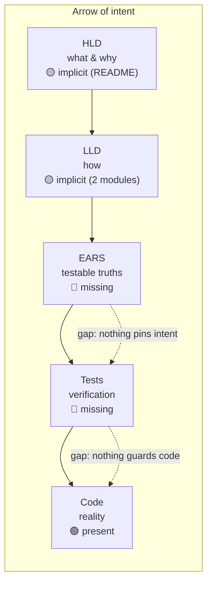
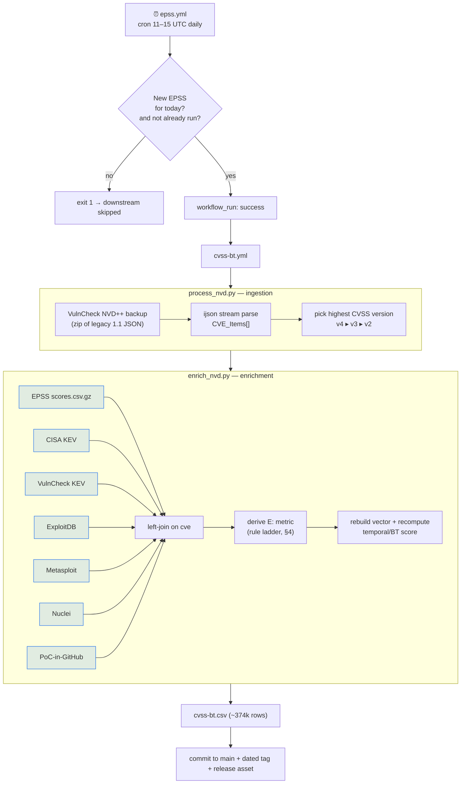

# cvss-bt — Design-Driven Development Audit

> **Method.** This is a *reverse-engineering* audit. The repository ships code, a README, GitHub
> automation, and a daily-regenerated dataset — but no design docs, specs, or tests. So the
> "arrow of intent" (HLD → LLD → EARS → Tests → Code) is entirely *implicit*. This document
> reconstructs each level from the artifacts that exist, checks the levels for coherence, states
> the goals (explicit and emergent), and proposes grounded extensions.
>
> Audit date: 2026-08-11 · Scope: full repo at `t0sche/cvss-bt` · Branch: `claude/design-audit-dkazz8`

---

## 1. Executive summary

**What this project is.** A serverless, zero-infrastructure **data-enrichment pipeline** that takes
NVD CVSS *Base* scores and continuously re-derives a **CVSS-BT** (Base + Threat) score for every CVE
by inferring the CVSS **Exploit Code Maturity / Exploitability (E)** temporal metric from seven public
threat-intelligence sources. It runs entirely inside GitHub Actions on a daily schedule and publishes
the result as a single CSV committed to `main` (and attached to a dated release).

**The one-sentence thesis.** *NVD Base scores don't tell you what's actually being exploited; folding a
data-derived `E:` metric back into the CVSS vector produces a free, transparent, daily "is this weaponized?"
signal for every CVE.*

**Arrow-of-intent health.** The vision (README) and the code are individually coherent and the pipeline
works, but the chain has **three structurally missing links and one live drift**:

| Arrow level | State | Notes |
|---|---|---|
| **HLD** (what/why) | 🟡 Implicit | Fully recoverable from README; never written down as design. |
| **LLD** (how) | 🟡 Implicit | Recoverable from two ~100-line modules; the E-value decision logic is undocumented. |
| **EARS** (testable truths) | 🔴 Missing | No requirements exist; reconstructed in §5. |
| **Tests** | 🔴 Missing | `test.sh` is a *pipeline runner*, not a test suite. Zero assertions anywhere. |
| **Code** | 🟢 Present | Clean, readable, does what the README claims — with one contradiction (§6.1). |

**Headline findings** (detail in §6):
1. **README ↔ code drift on Metasploit.** README maps Metasploit → `High (E:H)` for v3.x/v2; the code maps
   it to `Functional (E:F)`. The same CVE is classed differently by version, and the doc disagrees with the code.
2. **No tests + no dependency pinning** = a daily unattended job whose output can silently change or break
   when an upstream dep or feed shifts (already hit once: PR #44, pandas 3.0 `fillna`).
3. **Calibration provenance is stale.** The 0.36 EPSS threshold is documented as calibrated to *EPSS v3*;
   EPSS v4 has since shipped. The number is a load-bearing constant with no re-validation hook.
4. **Provenance gap.** The CSV records *which* feeds a CVE appears in, but not *which rule fired* to set the
   E-value — the exact ask of open PR #46.
5. **Distribution is straining the transport.** An 81 MB CSV rewritten into git every day inflates history
   and is awkward to consume — the driver behind open PR #43 (Parquet).

---

## 2. The arrow of intent (reconstructed)

The productive read: **the vision and the code are the two anchored ends of the arrow, and the middle
(specs + tests) is empty.** That is exactly the failure mode design-driven development exists to prevent —
there is no independent statement of "what must be true" that a change could be checked against, so drift
(finding §6.1) is invisible until a human reads both the README and the code side by side.

---

## 3. Data-flow architecture (reconstructed)

**Architectural characteristics worth naming:**
- **Zero standing infrastructure.** GitHub Actions is compute, git is the database, releases are the CDN.
  Total operating cost ≈ a VulnCheck API key.
- **Two-stage gated cron.** `epss.yml` is a cheap guard (has today's EPSS dropped? has the job already run
  today?) that only fires the expensive `cvss-bt.yml` on success via `workflow_run` chaining. Elegant, and
  it makes the pipeline idempotent-per-day.
- **VulnCheck is the spine, not a feed.** VulnCheck supplies *both* the NVD mirror (NVD++ backup, in the
  legacy NVD 1.1 `CVE_Items` schema) *and* the VulnCheck KEV feed. It is a hard single point of dependency —
  losing the key stops ingestion entirely, not just one signal.
- **Highest-version-wins.** Per CVE the pipeline takes the richest CVSS representation available
  (v4 ▸ v3 ▸ v2), which is why the scoring code branches on `cvss_version` throughout.

---

## 4. The core algorithm: deriving the `E:` metric

This is the heart of the system and the least-documented part. Reconstructed from `enrich_nvd.py:133-186`.

Each CVE is tagged `True`/`False` for presence in each feed (plus its EPSS probability). A **rule ladder**
then assigns the exploit-maturity token, and — crucially — **the mapping differs by CVSS version** because
CVSS v4 renamed/re-scoped the metric (it has `A` "Attacked" and no `F` "Functional"; v3/v2 have `H` and `F`).

| Signal a CVE carries | CVSS v4 → | CVSS v3.x → | CVSS v2 → |
|---|---|---|---|
| CISA KEV **or** VulnCheck KEV **or** EPSS ≥ 0.36 | `E:A` | `E:H` | `E:H` |
| Metasploit module | `E:A` | **`E:F`** ⚠ | **`E:F`** ⚠ |
| Nuclei template | `E:A`* → `E:P` | `E:F` | `E:F` |
| ExploitDB **or** PoC-in-GitHub only | `E:P` | `E:P` | `E:POC` |
| none of the above | `E:U` | `E:U` | `E:U` |

*Precedence is top-down: a higher row wins. In v4, Metasploit and Nuclei fall under the `condition_ea`
"Attacked" umbrella except Nuclei/ExploitDB/PoC route to `E:P` when no KEV/EPSS/Metasploit signal exists
(`condition_ep4`).*

⚠ **The Metasploit rows are the drift** (see §6.1): for v4, a Metasploit module lifts a CVE all the way to
`E:A` (Attacked), but for v3/v2 the *same module* only reaches `E:F` (Functional) — and the README claims it
should reach `E:H` (High). Three different answers for one fact.

After the token is chosen, the code splices it into the base vector (regex-replacing any existing `/E:` token)
and recomputes the score with the `cvss` library — `temporal_score` for v2/v3, `base_score` for v4 (v4 folds
threat into one score), plus the corresponding severity band.

---

## 5. Reconstructed EARS specifications

Requirements the code *implicitly* commits to, expressed in EARS with semantic IDs and status markers
(`[x]` implemented · `[ ]` gap / unverifiable without tests · `[D]` deferred/desired). These do not exist in
the repo today; they are proposed as the missing arrow link.

### Ingestion (`INGEST`)
- `[x]` **INGEST-CORE-001** — The system shall source NVD CVE records from the VulnCheck NVD++ backup archive.
- `[x]` **INGEST-CORE-002** — When a CVE exposes multiple CVSS versions, the system shall select the highest available (v4 ▸ v3 ▸ v2).
- `[x]` **INGEST-CORE-003** — Where a CVE description begins with `**` (NVD REJECT/DISPUTE marker), the system shall exclude that CVE.
- `[x]` **INGEST-PERF-004** — The system shall parse NVD JSON as a stream (ijson) rather than loading whole files into memory.
- `[ ]` **INGEST-DATA-005** — Where a CVE has no CVSS metric of any version, the system shall emit it with `N/A` fields rather than dropping it. *(Behavior exists but is unverified and interacts with issue #30 "Missing CVEs".)*

### Enrichment (`ENRICH`)
- `[x]` **ENRICH-SRC-001..007** — The system shall left-join CVE presence flags from EPSS, CISA KEV, VulnCheck KEV, ExploitDB, Metasploit, Nuclei, and PoC-in-GitHub respectively.
- `[x]` **ENRICH-SRC-008** — The system shall page through the full VulnCheck KEV result set (`_meta.total_pages`).
- `[x]` **ENRICH-DATA-009** — After joins, the system shall default missing feed flags to `False` and missing EPSS to `0.0`, and de-duplicate on `cve`.

### Exploit-maturity derivation (`EMET`)
- `[x]` **EMET-RULE-001** — Where a CVE is in CISA KEV, VulnCheck KEV, or has EPSS ≥ threshold, the system shall assign `E:H` (v2/v3) or `E:A` (v4).
- `[ ]` **EMET-RULE-002** — Where a CVE has a Metasploit module (and no higher signal), the system shall assign the maturity documented in the README. *(⚠ README says `E:H` for v3/v2; code produces `E:F`. Intent is contradictory — must be resolved before this spec can be marked `[x]`.)*
- `[x]` **EMET-RULE-003** — Where a CVE has a Nuclei template (and no higher signal), the system shall assign `E:F` (v2/v3) or `E:P` (v4).
- `[x]` **EMET-RULE-004** — Where a CVE appears only in ExploitDB or PoC-in-GitHub, the system shall assign `E:P` (v3/v4) or `E:POC` (v2).
- `[x]` **EMET-RULE-005** — Where no exploit signal exists, the system shall assign `E:U`.
- `[x]` **EMET-CFG-006** — The EPSS threshold shall be `0.36`, justified as the F1-optimal operating point of the EPSS model.
- `[ ]` **EMET-CFG-007** — The threshold justification shall reference the *currently deployed* EPSS model version. *(Documented against EPSS v3; v4 has shipped — stale.)*

### Scoring (`SCORE`)
- `[x]` **SCORE-CALC-001** — The system shall splice the derived `E:` token into the base vector, replacing any pre-existing `E:` token.
- `[x]` **SCORE-CALC-002** — The system shall recompute the score per version: temporal (v2/v3) or base (v4).
- `[x]` **SCORE-ERR-003** — Where vector computation fails, the system shall emit `UNKNOWN`/`UNKNOWN` rather than aborting the run.

### Publishing & operations (`PUB` / `OPS`)
- `[x]` **PUB-OUT-001** — The system shall write `cvss-bt.csv` with the fixed 17-column schema, sorted by `published_date`.
- `[x]` **PUB-REL-002** — On change, the system shall commit to `main`, create a dated tag `vYYYY.MM.DD`, and attach the CSV as a release asset.
- `[x]` **OPS-SCHED-001** — The system shall check for new EPSS data on a daily cron and only run enrichment when new data exists and the job has not already run today.
- `[D]` **PUB-OUT-003** — The system shall also publish a columnar (Parquet) artifact for efficient consumption. *(Open PR #43.)*
- `[D]` **PUB-OUT-004** — The output shall record the source/rule that determined each CVE's `E:` value. *(Open PR #46.)*

---

## 6. Coherence audit (drift, gaps, risks)

### 6.1 🔴 Live drift — Metasploit maturity (README vs code)
`README.md:21` lists **Metasploit** as a source for the `High (H)` value (v3.1/3.0/2.0). But
`enrich_nvd.py:142` (`condition_eh`) **omits Metasploit**, and `:144` (`condition_ef`) routes it to `E:F`.
Net effect: a Metasploit-only CVE is `E:F` under v3/v2 but `E:A` under v4 — and neither matches the README's
`E:H` claim. This is the textbook symptom the arrow-of-intent guards against: two levels disagree and there is
no spec/test to catch it. **Resolution is a product decision** (is a Metasploit module "Functional code" or
"actively attacked"?), and once decided it should be cascaded to README + EMET-RULE-002 + a test.

### 6.2 🔴 Missing verification layer
There are **no tests**. `test.sh` re-runs the whole pipeline against live feeds — useful as a smoke run,
worthless as a regression guard. Nothing asserts that a KEV CVE yields `E:H/E:A`, that vector splicing is
idempotent, that a known vector recomputes to a known score, or that the schema stays stable. For a job that
runs **unattended daily and publishes to consumers**, this is the highest-leverage gap.

### 6.3 🟠 Reproducibility / supply-chain fragility
`code/requirements.txt` pins nothing (`cvss`, `pandas`, `requests`, `ijson`). A daily job on floating deps
means the output can change or break without a code change — already demonstrated by **PR #44** (pandas 3.0
`fillna` on mixed-type columns). Combined with 6.2, a silent numeric drift in scores could ship unnoticed.

### 6.4 🟠 Stale calibration constant
`EPSS_THRESHOLD = 0.36` is justified against "EPSSv3" in both README and code comment. EPSS v4 shipped in
2025; the F1-optimal point may have moved. The number is load-bearing (it gates every KEV-less CVE into
`E:H/E:A`) yet has no revalidation cadence and mixes 36% (code) with 37% (README prose).

### 6.5 🟡 Distribution scaling
The deliverable is a single **81 MB, ~374k-row CSV committed to git every day**. Fifty commits already; each
rewrites the whole blob, so history growth is roughly linear in file size × days. It is also awkward to query.
This is the concrete driver behind **PR #43** (Parquet) and touches consumer accessibility broadly.

### 6.6 🟡 Provenance not captured
Consumers can *infer* why an E-value was set by reading the seven boolean columns against the §4 ladder, but
the CSV never records the deciding rule/source. **PR #46** proposes an explicit `exploit_maturity_source`
column — cheap, and it makes the dataset auditable without re-implementing the ladder.

### 6.7 🟡 CI maintenance debt
`cvss-bt.yml` uses `actions/checkout@v2`, `setup-python@v2`, `create-release@v1`, `upload-release-asset@v1`
(Node 12/16-era, deprecated) and the **removed** `::set-output` syntax at `:61` for tag generation
(GitHub disabled `set-output`; PR #39 was a prior fix in this area). These are latent breakage points for the
release/tag steps. The `create-release`/`upload-release-asset` actions are archived and should move to
`softprops/action-gh-release` or `gh release`.

### 6.8 🟡 Documentation artifacts drift
The Sankey mapping image (`CVSS-BT-Enrichment.png`) is captioned "as of November 25th, 2023" and is manually
regenerated — issue #10 and PRs #34/#41 all orbit auto-generating it. It no longer reflects the v4 ladder.

### 6.9 ⚪ Minor
- `epss.yml` triggers on `push: dev`, but `cvss-bt.yml` unconditionally `git push origin HEAD:main` — results
  always land on `main` regardless of trigger origin.
- `condition_ep` uses `df['exploitdb'] | df['poc_github']` without parentheses inside a broader `&` chain;
  correct here by Python precedence but fragile to edit.
- No handling for a partial feed outage (e.g., Nuclei URL 404) beyond a printed message — a fetch failure for
  one feed silently yields all-`False` for that signal, quietly downgrading maturity across the dataset.

---

## 7. Goals

**Explicit (stated in README):**
1. Enrich NVD Base scores with the CVSS Threat (E) metric to produce CVSS-BT.
2. Do it **continuously** and **publish daily**.
3. Aggregate a broad, transparent set of OSINT exploit signals (7 feeds).
4. Support CVSS v2, v3.0/3.1, and v4.0, using the highest available version per CVE.
5. Stay honest about limits (the "don't use 36% as a general prioritization threshold" caveat).

**Emergent / implicit (revealed by the design, not stated):**
6. **Zero-cost, zero-ops.** The entire value prop rides on GitHub Actions + git + releases.
7. **Transparency as the product.** Unlike a proprietary score, every input feed and the derivation are open —
   the boolean columns *are* the audit trail. (PR #46 is the community asking to make this explicit.)
8. **A drop-in CVSS upgrade.** Output stays in native CVSS vector form so existing CVSS tooling ingests it
   unchanged — the temporal metric is added, not a new scale invented.
9. **Freshness over completeness.** The daily-gated design optimizes for "today's exploit reality," accepting
   that a missed feed or dep hiccup degrades a day rather than halting the project.

---

## 8. Potential extensions (prioritized)

Grounded in the findings above and the open issue/PR backlog. Ordered by leverage-to-effort.

### Tier 1 — close the arrow (foundational, low effort, high leverage)
1. **Resolve the Metasploit drift (§6.1)** and write it once into README + EMET-RULE-002.
2. **Add a real test suite** — golden-vector tests for the E-ladder (one CVE per rule × version), a vector-splice
   idempotency test, and a schema-stability test. This is the single highest-value change; it turns the
   reconstructed EARS in §5 into executable guards.
3. **Pin dependencies** (`requirements.txt` → exact or compatible-release versions) and add a scheduled
   dependency-update check. Directly retires the class of failure behind PR #44.
4. **Modernize the CI actions and replace `::set-output`** (§6.7) to de-risk the daily publish.

### Tier 2 — make the dataset first-class
5. **Provenance column** (`exploit_maturity_source`) — adopt/close PR #46. Cheap, aligns with the transparency goal.
6. **Parquet (and/or compressed CSV) output** — adopt/close PR #43. Consider stopping the daily 81 MB blob
   from living in git history (e.g., publish data only as release assets / a `data` branch / an external bucket)
   to arrest history bloat (§6.5).
7. **Auto-generated Sankey/summary viz** on each run — closes issue #10 and PRs #34/#41, and kills the stale-image drift.

### Tier 3 — deepen the model
8. **Threshold as configuration + recalibration hook** — externalize `EPSS_THRESHOLD`, document it against the
   live EPSS model version, and (revived from closed PR #31) allow consumers to request alternate operating points.
9. **Per-feed freshness/health telemetry** — record each feed's fetch status and row count per run so a silent
   feed outage (§6.9) is visible instead of quietly downgrading maturity.
10. **Coverage/"missing CVEs" reconciliation** — instrument the `**`-reject filter and no-CVSS path to quantify
    and explain gaps (issue #30), and evaluate the CISA KEV JSON schema change flagged in issue #29.
11. **Environmental/CVSS-BTE roadmap** — the natural next step beyond BT is letting consumers layer Environmental
    metrics; the vector-native output already makes the dataset a clean substrate for it.

### Tier 4 — formalize the design
12. **Materialize this audit into the design-driven doc tree** — promote §4/§5 into `docs/high-level-design.md`,
    `docs/llds/enrichment.md`, and `docs/specs/*.md`, then annotate the code with `@spec` IDs so the arrow stays
    coherent going forward. (I can generate this scaffold on request.)

---

## 9. Recommended next step

The cheapest move that most improves project health is **Tier 1 #1 + #2 together**: decide the Metasploit
semantics, encode the §4 ladder as golden-vector tests, and let the tests — not a human diffing README against
code — hold the arrow straight from here on. Everything else in Tier 2+ is safe to build on top of that guard.
